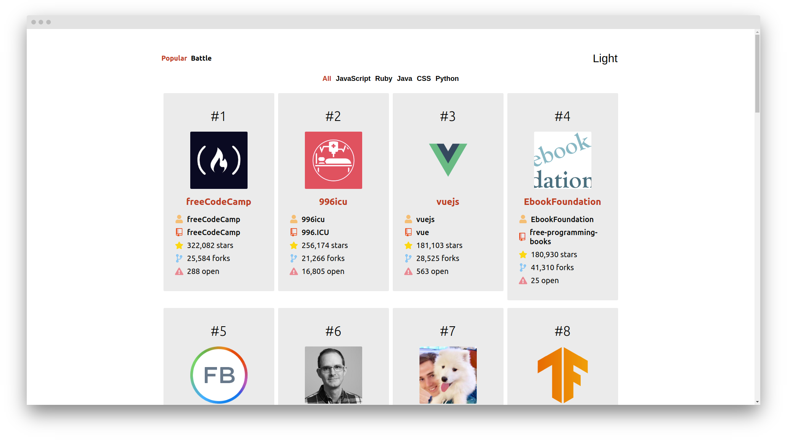

## Github Battle

An open, extensible, platform for github users to track top repositories of various programming languages.
Try out Github Battle's hosted version at
 <https://www.react-githubbattle.netlify.app.com> .



## Installation

Use the package manager npx create-react-app to install.

### 1.Github Battler requires the following dependencies:
     i. Nodejs 
     ii. NPM 
 2. Clone this repo
 3. Run **_npm install_**, this wil download dependencies.
 4. Run ***npm run start*** to run the server in development mode.


## Usage

```python
npm run start

```


## License
[MIT](https://choosealicense.com/licenses/mit/)
